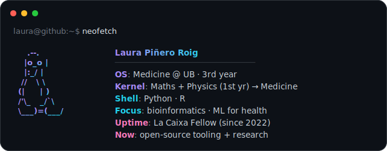

 

## `// about`

Med student who started out in maths and physics, and now writes code to make biomedical
research a bit easier. Into open-source scientific tooling, machine learning for health, and
reproducible clinical-epidemiology projects of my own.

## 🔬 Open-source contributions

- **[Biopython](https://github.com/biopython/biopython)** — 2 PRs merged (#5202, #5205) cleaning up `__next__` docstrings across `Bio/SeqIO/`. A third PR (#5216) is in review. Listed in `CONTRIB.rst` and the 1.88 release notes.
- **[Nipoppy](https://github.com/nipoppy/nipoppy)** — neuroimaging framework. PR #987 merged (fix for emphasize-lines drift in the HPC scheduler docs). Two PRs open: #995 (snapshot guardrail to prevent the same kind of drift recurring) and #1019 (warning for participant IDs that look like `sub-sub123` after BIDS prefix stripping).

## ☀️ Google Summer of Code 2026 — proposal prototypes

> Projects I designed and prototyped for my GSoC applications.

- **[ProteoClinView](https://github.com/laurapiro17/ProteoClinView)** — OpenMS Project C1, interactive proteoform-centric visualization for top-down proteomics. Streamlit + OpenMS-Insight (`SequenceView`, `LinePlot`, `StateManager`); sequence viewer cross-linked to a mirror plot with per-peak Δppm; fragment ion matching (c/z/b/y, multi-charge) for human insulin B chain, ubiquitin, and hemoglobin α N-terminus. [Live demo](https://laurapiro17-proteoclinview-app-tv7oqq.streamlit.app/).
- **[PrediCT-submission](https://github.com/laurapiro17/PrediCT-submission)** — ML4Sci Project PREDICT2, radiomics feature extraction and calcium phenotype discovery on the Stanford COCA dataset. Agatston scoring, PyRadiomics feature matrix, Spearman + Kruskal-Wallis filtering, t-SNE coloured by Agatston category, K-Means clustering.

## 📈 Research

- **[wcmsr-creatine-nhanes](https://github.com/laurapiro17/wcmsr-creatine-nhanes)** — secondary analysis of NHANES 2013–March 2020 data extending Bakian et al. 2020 on dietary creatine and depression risk. Adds a dose-response model with restricted cubic splines and a formal interaction test with antidepressant use. Abstract submitted to the IJMS World Conference of Medical Student Research (virtual, July 2026), currently in peer review.

## 🛠️ Other projects

- **[abrasas-reservas](https://github.com/laurapiro17/abrasas-reservas)** — reservation system for a local restaurant (Next.js + TypeScript, deployed on Cloudflare Pages).

## 📊 GitHub stats

<!-- ⏱️ Code Time (WakaTime) — descomenta aquestes 3 línies quan tinguis WakaTime connectat i posa el teu usuari:

-->

<code>laura@github:~$ echo "thanks for visiting ✨"</code>

